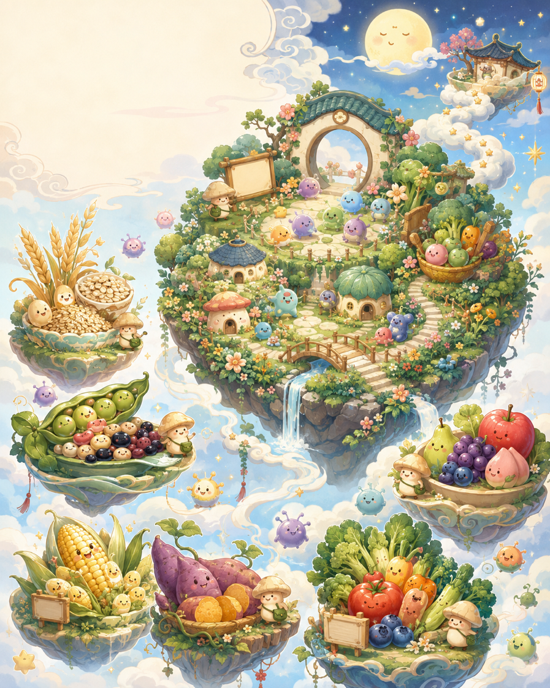
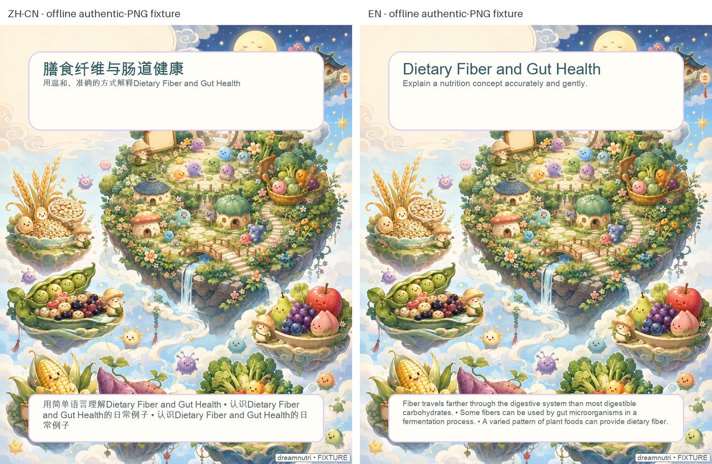

# Cute Chinese Dreamcore Nutrition Illustration

A six-stage product chain for turning an arbitrary science-popularization topic into one cute Chinese dreamcore floating-island illustration package.



> **Authentic example label:** the image above is the human-supplied authentic `0718_1.png` example (SHA-256 `4d7f583ad897190720038f0f00775aae876593166d0fe2978aa0623be06feaf2`). This repair preserves its original PNG bytes; it was not regenerated here and does not prove a live API call.

### Actual bilingual overlay proof (offline fixture)



This proof reuses the exact supplied artwork bytes, then exercises the real compositor twice: zh-CN on the left and English on the right. Chinese glyph rendering, mixed CJK/Latin word-safe wrapping, overflow flags, and visible `FIXTURE` provenance were checked. The proof image is a resized review JPEG (SHA-256 `035c2ebdf8ec1dc57909d1d0b6a43b8ea1cc677d450f6bd40d6ba86cf96263ff`); it is **not** evidence of a live GPT or image-provider call, and it is not an aesthetic acceptance claim.

## Exact product chain

1. **Topic input:** accept a science-popularization topic, audience, language, format, and optional caller-supplied content.
2. **Teaching-priority extraction:** GPT-5.6 extracts one to three audience-facing teaching priorities. The typed, injectable planner validates the result before continuing.
3. **Structured visual-spec generation:** GPT-5.6 turns those priorities into a validated structured visual plan: messages, metaphors, island world, motifs, and image direction.
4. **Dreamcore compilation:** the existing style/world compiler converts that validated plan into cute Chinese dreamcore floating-island drawing instructions, safe zones, and a negative prompt.
5. **Illustration generation:** the selected image provider generates the real artwork without long embedded text. A real-provider run writes `illustration_raw.png`.
6. **Accurate overlay and export:** Pillow selects `text_zh_cn` for Chinese runs or `text_en` for English runs, adds title/subtitle/callouts, and exports `illustration_final.png` plus the inspectable package and provenance manifest.

This project performs only that chain. It is not a content-review engine. Missing citations, medical words (`prevention`, `treatment`, `diagnosis`), and numbers do not block generation; upstream authors remain responsible for their content.

## Installation

```bash
python3.11 -m venv .venv
source .venv/bin/activate
pip install -r requirements.txt
pip install -e .
```

No API key is required for the default offline path.

## Offline development

The default `mock` request mode uses an explicitly named `FakeTextPlanner` for offline tests and a `MockProvider` for layout previews. The fake is never described as GPT-5.6, and mock previews are always labeled **LAYOUT MOCK — NOT FINAL ARTWORK**. They do not prove artwork style fidelity.

```bash
PYTHONPATH=src python -m dreamnutri.cli generate \
  --topic "Dietary Fiber and Gut Health" \
  --audience "general adults" \
  --language en \
  --provider mock \
  --output outputs/fiber-poster
```

Inject `FakeTextPlanner` in tests with `generate_package(..., text_planner=FakeTextPlanner())`. It records both explicit planning stages and validates both Pydantic contracts. A production planner failure is reported as unavailable; it never silently substitutes fabricated GPT output.

## Production providers

The text planner uses existing `httpx` and an OpenAI-compatible endpoint. Configure the text stage explicitly:

```bash
export OPENAI_API_KEY="..."
export OPENAI_TEXT_MODEL="gpt-5.6"
export OPENAI_TEXT_ENDPOINT="https://api.openai.com/v1/chat/completions"
```

The image adapter remains explicit and separate:

```bash
export OPENAI_IMAGE_MODEL="your-approved-image-model"
export OPENAI_IMAGE_ENDPOINT="https://api.openai.com/v1/images/generations"

PYTHONPATH=src python -m dreamnutri.cli generate \
  --topic "Dietary Fiber and Gut Health" \
  --audience "general adults" \
  --language zh-CN \
  --provider openai \
  --output outputs/fiber-poster-real
```

No key is stored or logged. If the text or image provider is unavailable, the package records the error and does not create final artwork. The offline `FixtureImageProvider` is provided only for deterministic decoded-PNG path tests; it is not a live provider.

## Inspectable outputs

A run writes the request, normalized facts, two-stage planning provenance, `visual_spec.json`, image and negative prompts, bilingual captions and alt text, quality reports, mock previews, and `generation_manifest.json`. Successful real-provider or fixture-provider tests additionally write `illustration_raw.png` and `illustration_final.png`.

The authentic demo is kept only at `docs/images/authentic-demo-0718_1.png` with its original hash. README alt text describes the visible floating-island educational scene and does not claim that this repair regenerated the image.

## Boundaries

The world is symbolic, not literal anatomy. The renderer does not import an evidence-review policy, retrieve literature, diagnose, treat, promise prevention, or provide individualized medical advice. It only compiles the validated planning result and exports the requested illustration package. Real artwork still requires human review for visual fidelity, accessibility, interpretation, and provider licensing.

## Tests

```bash
PYTHONPATH=src pytest -q
PYTHONPATH=src python -m compileall -q src tests
```

## License and originality

Code is released under the MIT License. Example JSON and text are project-original. Generated images are subject to the selected provider's terms. No copyrighted characters, copied art, third-party font files, living-artist imitation, or franchise assets are included. The project name and visual system should be treated as project identifiers rather than an assertion of trademark registration.

## Author

Designed by a Chinese Registered Dietitian to combine evidence-based nutrition communication with an original cute Chinese dreamcore visual system.
